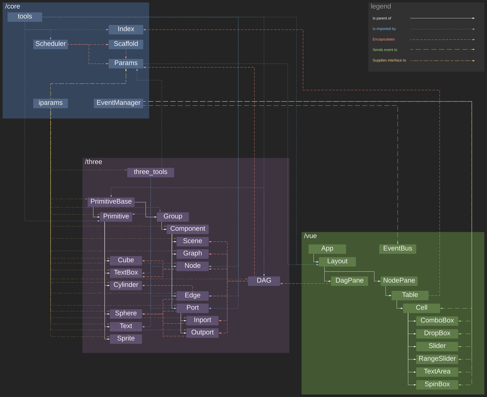

# Aspect-js
Aspect is a web-based nodal editor, built upon Typescript, Vue and Three.js.
Its goal is to provide a graphical means of constructing Directed Acyclic Graphs
(DAGs) which map to RPC APIs and map-reduce systems, defined elsewhere. In the
broadest sense, Aspect can be thought of as a stateless function, which takes in
a scene defintion and returns a new one.

Intended targets for Aspect-js are:
- Aspect: a python library that generates REST APIs around arbitrary python code
  through inspection.
- Apache Beam: A distributed map-reduce system.
- Apache Spark: A distributed map-reduce system common.
- Geode: A proprietary spatial, n-dimensional distributed map reduce framework I
  am working on.

# Explanation
After having worked years with several nodal systems: Nuke, Houdini, Maya's
hypershade, Softimage, Fabric Engine, Modo's schematics, MeVisab, etc. And
some time with several map reduce frameworks: Geode, Apache Spark, Apache Beam,
and Apache Hadoop. And attempting to build custom dataflow oriented frameworks:
Axon (https://github.com/theNewFlesh/axon) and interogrador, a custom map-reduce
framework for mesh construction inside Modo. I have come to the conclusion that
visual, DAG-oriented programming can be a very poweful paradigm for performing
and comprehending complicated work, but that is bedevilled by its universal
implementation as part of the context of solving problems related to, and only
to, specific data structures, rather than as a general utility. This is
especially so in the realm of data science, particularly computer vision.

Good nodal editors, say those popular in visual effects, have shallow learning curves,
low technical barriers to entry and are incrediby useful. They are also proprietary,
tied to proprietary formats and designed to run one a single machine, even though
they are often found in render farms. Good data science libraries, can efficiently
exploit large distributed systems, are made incredibly powerful through the use of
machine learning, and can do things at a scale that no render farm and army of
humans can. They also have no decent nodal editors, large technical barriers to
entry and aren't easily accessible across locations.

Aspect-js is meant to combine these two worlds in a declarative manner, with
predifined extensibility and careful attention paid towards how it maps to
frameworks that solve hard problems at scale, rather than trying to compete with
them.

# Data Structures
A scene is a collection of graphs which may or may not connect to eachother.
Graphs are comprized of nodes and edges. Nodes should be thought of as abstract,
graphical representations of singular remote procedure calls. Nodes connect to
eachother via ports. The outport of one node connects to the inport of another,
and thus a graph network of computation becomes defined. Inports to a node,
represent the singular parameters of the RPC function it abstracts. Outports
represent what the RPC function returns. Edges are defined as an ordered pair of
outport and inport.

The scene and all its components are represented within a single JSON object
which represents the entire state of the DAG at one time. All other parts of
Aspect; the Three.js wrapper classes, the Params class, the NodePane component,
serve to manipulate this underlying data structure, as an aspect of it. For
instance, the class Node serves as the graphical, 3D aspect of a node as defined
within some graph of some scene. You can change its size, color, 3D position, etc.
In the NodePane, a different aspect of this underlying structure is represented:
its ports and their values. In the nodepane, you can alter the constant values
values supplied to specific ports of a node, you can alter the GUI widgets used
to represent each port, etc.

## Documentation
[aspect-js documentation page](https://thenewflesh.github.io/aspect-js/)

## Development Setup
`npm install`

## Documentation Autobuild Setup
1. [install conda](https://docs.conda.io/en/latest/miniconda.html)
2. `conda create -n aspect-js --file requirements.txt`

## Serve
`npm run serve`

Alternatively, I would recommend 
```
npm install -g @vue/cli
vue ui
```
and then click serve on the resulting vue ui page.

## Build
`npm run build` or click build in the vue ui page.

## Lint
`npm run lint` or click lint in the vue ui page.

## Test
`npm run test` or click test in the vue ui page.

## Docs
`bin/build-docs.sh`

## Architecture
